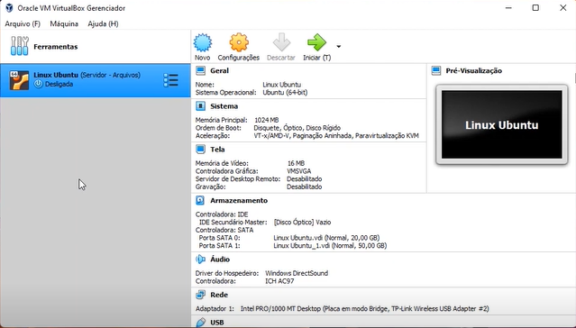
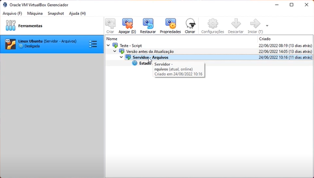
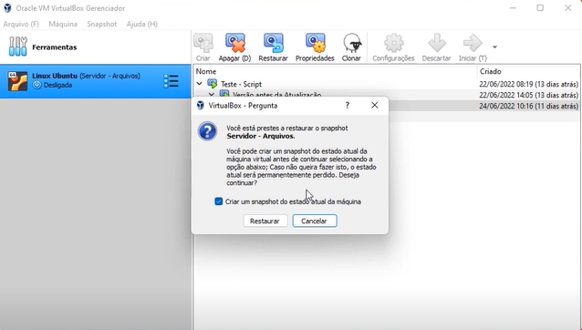
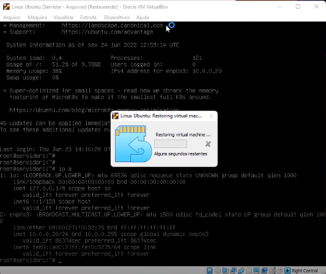
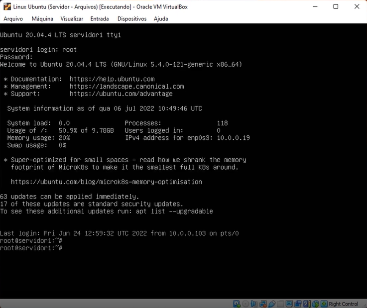
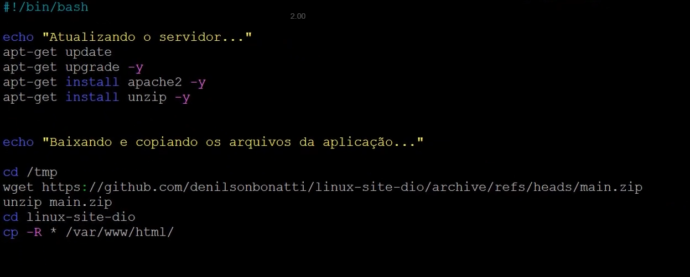
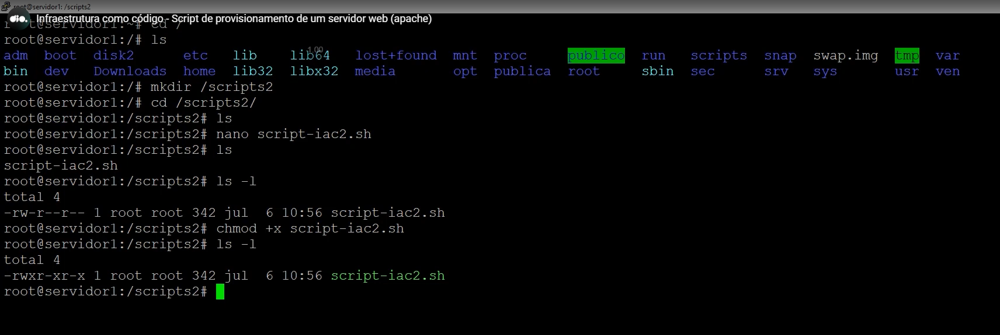
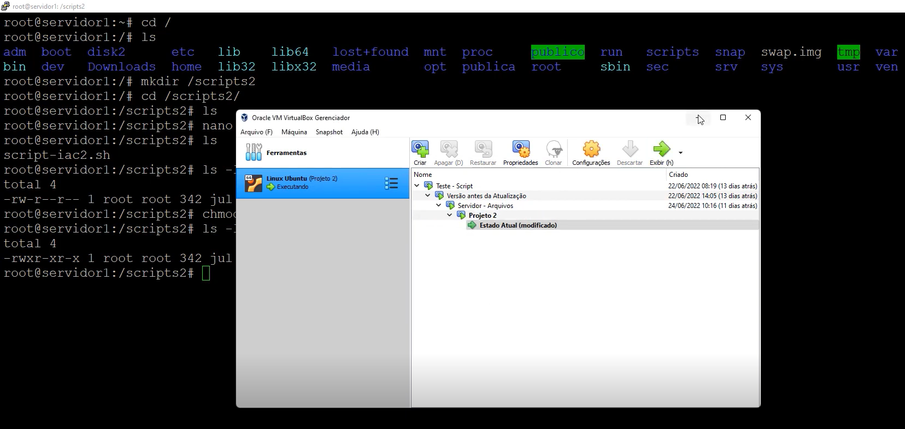
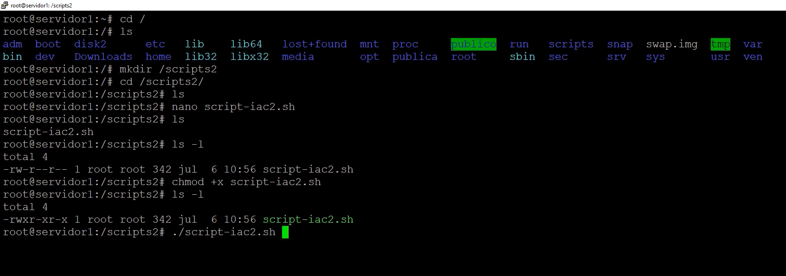

# 🐧 Provisionamento de Servidor Web Apache no Linux com Shell Script

Projeto desenvolvido como parte da **Formação Linux da DIO**, utilizando conceitos de **Infraestrutura como Código (IaC)** para automatizar o provisionamento de um servidor Apache em ambiente Linux virtualizado com **VirtualBox**.

---

## 📌 Objetivos do Projeto

* Automatizar a instalação de um servidor web (Apache)
* Demonstrar práticas de IaC com shell script
* Utilizar controle de versão com Git/GitHub
* Simular ambiente real com uso de máquina virtual e snapshot

---

## 🧾 Passo a Passo Detalhado com Imagens

### 🔹 Etapas da Implementação

#### **Passo 1: Criar e configurar a VM no VirtualBox**

Abra o VirtualBox e crie uma nova máquina com sistema **Ubuntu Server (64-bit)**. Alocar pelo menos 1024MB de memória RAM e criar um disco rígido virtual de 20GB.



#### **Passo 2: Verificar e gerenciar Snapshots**

Crie snapshots para poder restaurar o estado do sistema em diferentes pontos do projeto. Isso permite simular a execução do script do zero.



#### **Passo 3: Restaurar snapshot salvo**

Selecione o snapshot desejado e clique em “Restaurar”. Confirme a criação de um novo snapshot antes da restauração se quiser manter o progresso atual.



#### **Passo 4: Aguardar processo de restauração**

A VM será restaurada automaticamente para o estado capturado no snapshot anterior.



#### **Passo 5: Acessar a VM restaurada**

Após o boot, realize login com o usuário root e observe o status do sistema. A rede já deve estar configurada.



#### **Passo 6: Criar e escrever o script de provisionamento**

Crie um diretório `/scripts2/`, dentro dele um arquivo `script-iac2.sh`. O conteúdo do script instala o Apache e copia a aplicação para a pasta do servidor web.



#### **Passo 7: Tornar o script executável**

Use `chmod +x script-iac2.sh` para garantir permissão de execução. Verifique com `ls -l` se ele está com o atributo `x` (executável).



#### **Passo 8: Garantir snapshot do estado atualizado da VM**

Crie um novo snapshot com o script salvo e pronto para execução. Isso ajuda na retomada futura.



#### **Passo 9: Executar o script**

Execute o script com `./script-iac2.sh`. O Apache será instalado, os arquivos da aplicação baixados e copiados para `/var/www/html`.



---

## 💻 Ambiente Utilizado

* VirtualBox com Ubuntu Server 20.04 LTS
* Memória: 1024 MB
* Rede: Bridge
* Scripts criados manualmente e executados via terminal

---

## 🔧 Script de Provisionamento

### `provisionamento_apache.sh`

```bash
#!/bin/bash

echo "Atualizando servidor..."
sudo apt-get update -y
sudo apt-get upgrade -y

echo "Instalando Apache e Unzip..."
sudo apt-get install apache2 unzip -y

echo "Baixando aplicação web da DIO..."
cd /tmp
wget https://github.com/denilsonbonatti/linux-site-dio/archive/refs/heads/main.zip

unzip main.zip
cd linux-site-dio-main
sudo cp -R * /var/www/html/

echo "Iniciando serviço Apache..."
sudo systemctl restart apache2
sudo systemctl enable apache2

echo "Script de provisionamento finalizado com sucesso!"
```

---

## 🚀 Como Executar

1. Clone o repositório:

```bash
git clone https://github.com/seuusuario/provisionamento-apache.git
cd provisionamento-apache
```

2. Torne o script executável:

```bash
chmod +x provisionamento_apache.sh
```

3. Execute o script com permissões administrativas:

```bash
./provisionamento_apache.sh
```

4. Acesse o IP da sua VM pelo navegador:

```
http://SEU-IP
```

---

## 🧠 Conceitos Aplicados

* **Infraestrutura como Código (IaC)**: scripts automatizados para provisão de ambiente
* **Controle de versão com Git**: rastreamento e colaboração
* **Virtualização com VirtualBox**: simulação de ambientes reais
* **Serviços Linux**: instalação e gerenciamento de `apache2`

---

## 📁 Estrutura do Repositório

```
provisionamento-apache/
├── img/
│   ├── 01.png
│   ├── 02.png
│   ├── 03.png
│   ├── 04.png
│   ├── 05.png
│   ├── 06.png
│   ├── 07.png
│   ├── 08.png
│   └── 09.png
├── provisionamento_apache.sh
└── README.md
```

---

## 📝 Licença

Este projeto está licenciado sob a Licença MIT.

---

## 👨‍💻 Autor

Adriano Vilela
Formação Linux - DIO 🚀
[LinkedIn](https://www.linkedin.com/in/adrianogvs)
